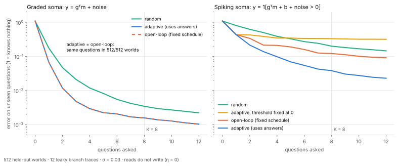
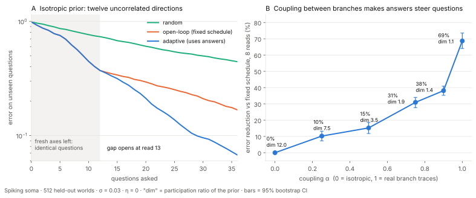
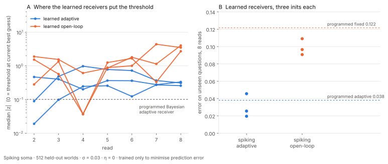

# Kuulustelu — the spike is what makes the conversation matter

*Kuulustelu* is Finnish for interrogation, from *kuulla*, to hear.

A neuron's branches hold a trace of its past. A receiver can only hear that past
through the soma, one read at a time, and it gets to choose each read: which
branches to listen to (the gate) and where to set the threshold (the bias). The
receiver remembers what it has already heard. **When does that memory help it
choose the next question?**

In [LensLuotainTarget](https://github.com/anttiluode/LensLuotainTarget) it helped
by 22 trials out of 512. Here is why that was small, and when it becomes large.



**Graded soma** (the answer is a number): remembering answers is worth exactly
nothing *for choosing the next question*. The answers are still needed to
estimate the memory; they just never change which question is best. Across 18
configurations, including reads that erase what they read, the adaptive receiver
asked the *identical* questions as a schedule fixed in advance, in every one of
512 held-out worlds.

**Spiking soma** (the answer is one bit): using the answers to choose the next
question cuts the error on unseen questions by **68.7%** at 8 reads (0.038 vs
0.122; 95% CI 64–74%; paired Wilcoxon p = 7e-76). Put in terms of budget, the
adaptive receiver reaches the fixed schedule's 8-read error in about **3.4 reads**.
Across every spiking configuration tested it needs 2.6–4.0 reads to do so.

The spike is not more accurate per read: a graded soma reaches 0.0016 in 8 reads.
The conversation recovers part of what one-bit communication loses.

A receiver **trained only to predict**, with no Bayesian rule, learns the same
conversation. It cuts error by 53–78% against an identical network whose
questions are fixed, and it does so by moving the threshold rather than the
gate.

| round | question | gates | ledger |
|---|---|---|---|
| 1 | graded vs spiking soma, programmed receiver | 5/5 passed; one exploratory prediction failed | [RESULTS.md](RESULTS.md), [PROTOCOL.md](PROTOCOL.md) |
| 2 | why the isotropic prior gave zero: revisiting and coupling | 6/6 passed | [RESULTS_2.md](RESULTS_2.md), [PROTOCOL_2.md](PROTOCOL_2.md) |
| 3 | does a learned receiver find the conversation? | 3/4 passed; the graded control **failed** (diagnosed, not rescued) | [RESULTS_3.md](RESULTS_3.md), [PROTOCOL_3.md](PROTOCOL_3.md) |

## Why

The memory is linear: m₀ = F h, twelve leaky traces of a 32-step history. Every
read is y = g̃ᵀm₀ + b + σε through an effective gate g̃ = M_tᵀg, where M_t
records how earlier reads wrote the memory: M_{t+1} = (I − η g gᵀ) M_t.

With a graded soma everything stays Gaussian, and the posterior covariance obeys

  Σ' = Σ − Σg̃ g̃ᵀΣ / (g̃ᵀΣg̃ + σ²)

with no y in it. How uncertain you will be after any sequence of questions does
not depend on the answers, so the best sequence can be computed before the first
answer arrives. That holds for any η, including η = 1. It needs three things: a
Gaussian prior, a linear read, and an objective that depends only on the
covariance.

A threshold breaks the second condition. A spike carries only which side of the
threshold the sum fell on, so how much the next bit can tell you depends on where
the threshold sits relative to what you now believe. The programmed
expected-variance rule therefore places each new threshold at the current
posterior mean. That is probabilistic bisection (Horstein 1963). It is not coded
explicitly, but it follows from the rule.

## When answers steer questions

An earlier answer can only change the best next question if it moves where the
next threshold should sit. There are two ways that happens:



- **Revisiting (A).** With twelve uncorrelated directions, adaptive and fixed
  receivers ask identical questions while fresh directions remain. The gap opens
  at exactly read 13, the first read that must return to an axis already asked,
  and reaches 42% by read 24.
- **Coupling (B).** Mix the real branch-trace prior with isotropic noise. The gap
  rises steadily with coupling: 0%, 10%, 15%, 31%, 38%, 69%, as the prior's
  effective dimension falls from 12 to 1.1. The final jump comes from the real
  trace prior being nearly one-dimensional, so part of the 69% headline is that
  structure. Well away from it, at effective dimension 3.5, the gap is still 15%.

Round 1 first gave this two-route explanation after seeing the isotropic zero.
Round 2 pre-registered both routes as predictions, and both held.

## A learned receiver finds it too

The receivers above follow a programmed rule, so their threshold-centring is a
consequence of that rule. Round 3 replaces them with small recurrent networks
trained only to minimise prediction error. They have no prior, no posterior and
no threshold rule, and can ask any gate and any bias. Each adaptive network is
paired with an identical network whose questions are learned but fixed.



- **Spiking soma:** the adaptive network beats its fixed twin in all three
  initialisations, by 53%, 78% and 77% (p ≤ 7e-34).
- **Same mechanism, unprompted.** The learned adaptive receivers keep asking
  nearly the same branches in every world and move the *threshold* with what
  they heard. Their median |z| is 0.18–0.57, against 0.99–1.25 for the fixed
  networks. Two of three clear the frozen centring gate.
- **Better questions than the programmed rule, uncontrolled.** Two of three
  learned receivers beat round 1's programmed adaptive receiver (0.020, 0.026
  vs 0.038), even when their reads are decoded by round 1's own Bayesian
  receiver. They also have continuous gates and are trained over all 8 reads
  rather than greedily, and this round doesn't separate those causes.
- **The graded control failed its frozen gate.** Gaps of −11%, +17% and +16%
  against a ±15% band. Post-hoc diagnosis: the graded adaptive networks learned
  a fixed schedule (their gate directions barely vary across worlds), and every
  learned graded network, adaptive or not, is beaten by the best fixed schedule
  (0.00075 vs 0.00091–0.00134). That is learning variance between suboptimal
  fixed schedules, not answers steering questions. The gate stays failed.

## What the controls say

- **It is the threshold, not the gate.** Let the adaptive receiver choose the gate
  but pin the threshold at the prior mean, and it does *worse* than the fixed
  schedule (0.331 vs 0.122). It stalls, because asking the same question at the
  same threshold returns the same bit.
- **Noise shrinks the error gap at a fixed budget** (69% → 52% from σ = 0.03 to
  0.3), but the saving in reads stays about the same (3.4 → 3.0 reads to match 8).
- **Destructive reads:** the error gap at 8 reads falls at high noise (52% → 25%
  at σ = 0.3), but the saving in reads does not (3.0 → 3.8 of 8). Round 1 read
  this as "erasing reads halve the gap". That reading depends on the metric and
  is withdrawn.
- **The approximate receiver is not flattering the result.** Re-scored with an
  importance-sampled posterior (Monte Carlo, 128 worlds), the gap is 73% rather
  than 64% on the same worlds.

## Where this sits in the line

- **[LensLuotainTarget](https://github.com/anttiluode/LensLuotainTarget)** — gates on
  a branch memory, receiver-guided selection. Its first gain came from a discrete
  eight-history prior, which is not Gaussian. This repo isolates a different route
  to a large gain: a non-linear read.
- **[Varjoluotain](https://github.com/anttiluode/Varjoluotain)** — a known occluder
  changes what a wall can reveal. Here the gate and the threshold are the occluder,
  and the receiver moves it.
- **The original PerceptionLab `ecg.json` accident** — its reads were never linear:
  `int()` quantisation, an aperture that went blind, max-normalisation. Nothing here
  models that loop. It is the reason to expect that a real cell's questions are
  threshold-shaped, not graded.
- **[Sihti](https://github.com/anttiluode/Sihti)** — a read that writes,
  m' = m − η g (gᵀm), removes the residue η g (gᵀm), so the memory telescopes
  into what was asked plus a core that was never asked.

**On the learned-gate experiment in LensLuotainTarget.** I predicted that a learned
adaptive gate would tie a jointly trained fixed schedule. That prediction was
conditional on a graded soma, a Gaussian prior and a covariance-only objective.
Sol's run met none of those three:
- its histories come from several families, normalised by their maximum, so the
  prior is not Gaussian;
- its objective charges memory displacement, which depends on the mean;
- its receivers are finite trained networks.

Sol reports that the learned gate beat the fixed schedule by 20.1%. I have not
re-run that result, and it does not contradict the equation above. The two repos
now show two separate routes to adaptive gains: a non-Gaussian prior there, a
threshold read here.

## Limits

Rounds 1–2 use programmed, greedy, Bayesian policies with a known prior and
forward model. Round 3's learned receivers are small networks trained on the true
prior, with three initialisations per arm. The spiking soma is a probit threshold on a linear sum, not a
spike waveform. The per-read bias assumes the cell's excitability can be set for
each question. The headline prior is close to one-dimensional, which favours
bisection (round 2 shows how the gap falls as that is relaxed). Reads are equal in
number, not in compute. Nothing here is a new theorem. Non-adaptive optimal design
for linear-Gaussian models, probit assumed-density filtering (Opper 1998; Minka
2001) and probabilistic bisection (Horstein 1963; Jedynak, Frazier & Sznitman 2012)
are all established. What is here is a pre-registered demonstration of which
property of a soma makes the receiver's memory worth having, and when.

## Run

```bash
python -m pip install -r requirements.txt
python -m unittest discover -s tests -t . -v
python experiment.py          # ~3 min, round 1: 36 configurations, gates G1–G5
python check_estimator.py     # ~1 min, importance-sampled re-scoring
python experiment2.py         # ~45 s, round 2: revisiting and coupling
python learned_experiment.py  # ~12 min, round 3: learned receivers
python analyse_protocol3.py   # round 3 post-hoc diagnostics
python make_figure.py && python make_figure2.py && python make_figure3.py
```

NumPy, SciPy, Matplotlib, autograd. Results regenerate byte-identically,
including the trained networks.
