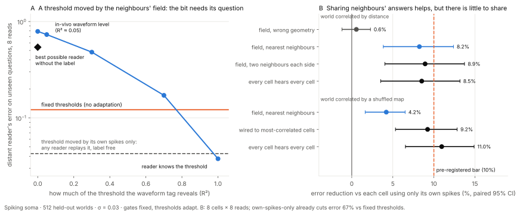

# Kuulustelu — protocol 4 outcome ledger

Protocol frozen in [PROTOCOL_4.md](PROTOCOL_4.md) (commit `d48dba0`) before any
run; code and tests committed (`35f2dd0`) before the held-out run. Held-out seeds
2000–2511 (512 worlds), training seeds 3000–3511. Spiking soma, σ = 0.03, η = 0,
K = 8, round 1's gate schedule throughout; only thresholds adapt.

**10 of 12 gates passed. Both failures are in part B, and one of them is that
part's kill condition.**

## Part A — the question label

A sender S reads the same memory as a neighbour N. In the "field" case S's
threshold is centred on a belief that includes N's answers, delivered losslessly
by the shared field. A distant reader sees only S's spikes.

| Gate | Outcome | Numbers |
|---|---|---|
| A0 correctness | PASS | 11 tests (batched probit = round 1's; inflated-noise probit vs importance sampling; replay = sender at c = 0; tree thresholds = sender on the realised branch; tree likelihood = brute-force sum over neighbour sequences; unlabeled = labeled when c = 0; part B checks) |
| A1 label free for self-driven thresholds | PASS | replayed thresholds equal the sender's exactly (max error 0.0); naive reader R = oracle R exactly |
| A2 replicates round 1 open-loop | PASS (after a gate-code fix, below) | 0.121576276 vs round 1's 0.121576276, difference 4e-17 |
| A3 threshold-only adaptation carries the gain | PASS | 0.0426 vs 0.1216: 64.9% lower [60.6, 69.4], p = 8.4e-65 |
| A4 unlabeled field-driven adaptation is no better than the fixed schedule | PASS, **by a wide margin** | best possible reader without the label: **0.541** vs 0.1216 fixed schedule (4.5× the error; p = 1.8e-60 for "worse") |
| A5 the threshold-as-noise reader loses to the fixed schedule | PASS | 0.790 vs 0.1216, p = 1.3e-63 |
| A6 a weak tag recovers little | PASS | monotone; recovery at R² = 0.05 is **7.6%** (gate < 25%) |

### Readers of the field-driven sender, 8 reads

| what the reader knows about S's thresholds | R |
|---|---|
| nothing — replays S as if it had no field (naive) | 0.782 |
| tag R² = 0 (threshold treated as noise) | 0.790 |
| tag R² = 0.05 (≈ in-vivo waveform → LFP level) | 0.732 |
| tag R² = 0.3 | 0.481 |
| tag R² = 0.7 | 0.171 |
| **exact Bayes reader, no label** (marginalises all 256 neighbour sequences) | **0.541** |
| oracle: knows every threshold (ADF) | 0.0377 |
| oracle, exact posterior (importance sampled) | 0.0296 |
| *for reference:* fixed-threshold sender, oracle ADF / exact posterior | 0.1216 / 0.1089 |
| *for reference:* self-driven sender, any reader (replay is exact) | 0.0426 |

Recovery of the oracle's advantage over tag(0), as a fraction: R² = 0.05 → 0.08,
0.3 → 0.41, 0.7 → 0.82. **Even at R² = 0.7 the tagged reader is worse than a
fixed schedule** (0.171 vs 0.122). Only the full label wins.

Importance sampling, 8192 particles per world, K = 8: median ESS 101 (unlabeled),
99 (labeled); minimum 14 and 20. The protocol's re-run rule (median < 50) did not
trigger. The few low-ESS worlds add Monte Carlo error to the 0.541 but cannot move
it near 0.122.

### What survived

1. **A bit is worth what its reader knows about the question.** Field-driven
   thresholds give the sender's own reads a better answer than self-driven ones
   (oracle 0.0377 vs 0.0426, two-sided p = 0.039, not decisive). To a reader
   outside the field, though, the same spikes are worth less than a fixed
   schedule's, even when decoded by the Bayes-optimal reader (0.541).
2. **The label is free when the threshold depends only on the cell's own spikes.**
   Any reader that sees the spikes and knows the rule replays every threshold
   exactly (A1). This was stated in the protocol before running; it narrows the
   conversational claim to the part of the threshold that comes from something
   the reader did not see.
3. **The weak waveform tag is nearly useless for this.** At the R² the waveform
   preprint reports in vivo, the tag recovers about 8% of what the label is worth.

### Why it is so large (post hoc, `analyse_protocol4.py`)

The correlation of S's bit with the value it was asked about shows the mechanism:

| sender | corr(bit, gᵀm₀) over reads 1–8 | median \|threshold − value\| / prior std |
|---|---|---|
| fixed thresholds | 0.80 0.73 0.73 0.80 0.78 0.61 0.61 0.77 | 0.89 |
| self-driven | 0.80 0.38 0.34 0.17 0.53 0.15 0.18 0.14 | 0.16 |
| field-driven | 0.40 0.26 0.18 0.21 0.43 0.14 0.17 0.16 | 0.10 |

A threshold that tracks the truth turns the bit into a near coin flip **about the
value**. It is informative only **relative to the threshold**. The self-driven
bits are just as decorrelated, and they decode fine because the reader can
reconstruct the threshold. The field-driven ones cannot be reconstructed. Their
threshold moves by about one prior standard deviation (variance of the
field-driven part 0.92–1.23 on most reads), so treating it as noise makes each
bit nearly worthless.

## Part B — a shared slow field among 8 cells

Cells on a line, memories correlated by distance (neighbour correlation 0.61).
"Field" = each cell's threshold is centred on a belief that includes its
neighbours' bits. That is lossless sharing, so it is an upper bound on what a
weak, blurred physical field could carry. One joint decoder scores every arm.

| Gate | Outcome | Numbers |
|---|---|---|
| B0 graded identical; addressed = field in the metric world | PASS | all six graded arms R = 0.00314, spread 2.5e-16; sets equal |
| B1 private centring beats fixed | PASS | 0.0328 vs 0.0988: 66.9% lower, p = 7e-86 |
| **B2 the field helps ≥ 10% (KILL for claim 2)** | **FAIL** | field r = 1 0.0301 vs private 0.0328: **8.2%** [3.7, 12.3], p = 3.7e-5. Real, significant, below the bar |
| B3 geometry matters | PASS | field 0.0301 vs shuffled 0.0326 (7.7%), p = 8.4e-5; shuffled ≈ private (0.6%) |
| B4 cheap | PASS | field r = 1 gets **97%** of broadcast's gain with 14 directed links instead of 56 |
| B5 field value conditional on metric correlations | **FAIL** | shuffled-map world: addressed 0.0308 vs field 0.0325: 5.3% (gate 10%), p = 8.3e-6. Right direction, below the bar |

| world | fixed | private | field r = 1 | field r = 2 | shuffled | addressed | broadcast |
|---|---|---|---|---|---|---|---|
| correlated by distance | 0.0988 | 0.0328 | 0.0301 | 0.0298 | 0.0326 | = field r = 1 | 0.0300 |
| correlated by a shuffled map | 0.0973 | 0.0339 | 0.0325 | — | — | 0.0308 | 0.0302 |

Mean correlation of a cell with the partners it hears, shuffled-map world: field
r = 1 0.30, addressed 0.59.

### What the failures say

**B2 is a ceiling, not a weak field.** Even broadcast, where every cell hears
every cell, improves on private centring by only 8.5%. The nearest-neighbour field
gets 97% of that, so the field captures almost all of what sharing could buy here.
Sharing itself buys little.

Post hoc, the threshold-centring diagnostic shows why. Private centring already
puts thresholds at a median 0.16 prior std from the truth; sharing tightens that
to 0.14. A cell's own answers do most of the centring within two or three reads.
The pre-registered claim "a shared field earns its place by carrying neighbours'
answers into each cell's threshold" therefore **fails at the size I set** in this
world. It holds as a direction (significant, geometry-specific), not as a large
effect.

**B5 has the same ceiling.** In the shuffled-map world the wired, correlation-
addressed coupling beats the metric field, 9.2% vs 4.2% over private. That
difference is significant but under the 10% bar between them. The direction
supports "the field is only as good as the world's correlations are metric", and
the effect is small for the same reason as B2.

## Deviations and bookkeeping

- **A2 gate code was wrong on the first run, and the protocol was not.** The
  protocol says "to 1e-12". The code compared against a hand-typed 0.12163 with
  tolerance 5e-5, but round 1's value is 0.121576. The gate was rewritten to read
  `results/summary.json` and use 1e-12, then the whole experiment was re-run. The
  per-world outputs of the two runs are identical, so the fix changed only the
  gate.
- The exact-labeled importance sampler centres its proposal on the oracle ADF
  posterior rather than on the tag(0) one. Same estimator, better proposal for a
  sharper posterior.
- Added, not pre-registered: the exact-posterior R for the fixed-threshold sender
  (0.1089), so A4 can also be read exact-vs-exact. The verdict does not change
  (0.541 vs 0.109).
- Determinism: two full runs, byte-identical per-world results.

## What this does not test

Same as the protocol: programmed Bayesian rules, a lossless "field", a synthetic
Gaussian tag, one neighbour in part A, one coupling length in part B. Part A's
oracle uses each threshold only as a likelihood parameter. A reader that also
read the threshold's *value* as a message about N's answers would do better than
0.0377, which would widen the label's worth, not narrow it.
